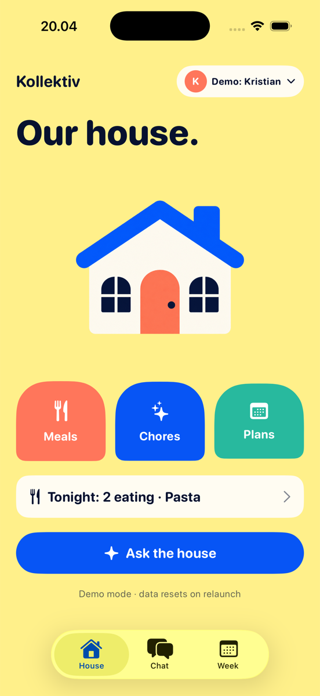
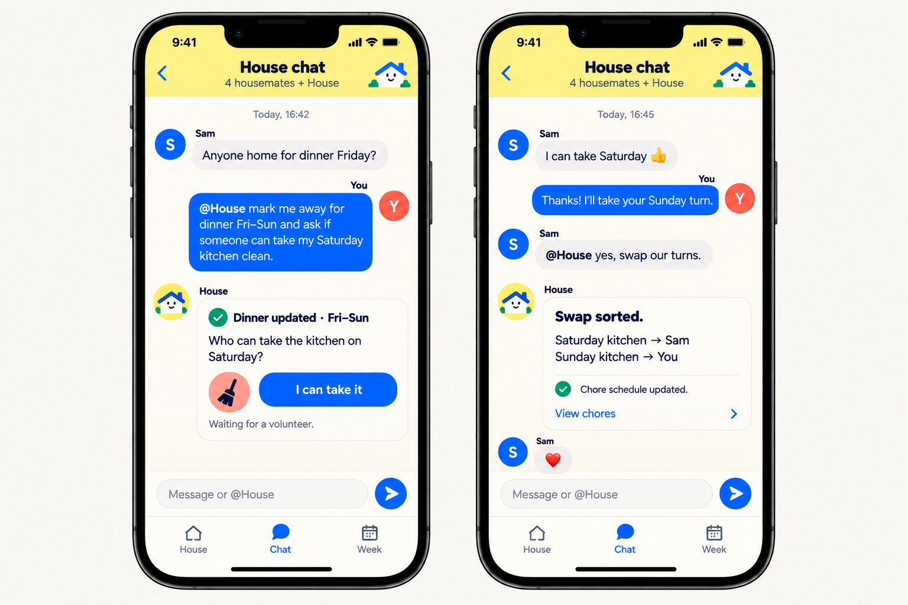

# Kollektiv

**Claude Tag for your house.** In Slack you tag Claude in a channel and it does the work in the context of that channel. Here you tag `@House` in your household chat, and it does the household's work in the context of the household's records.

Built in one day at the Claude Code build event, 14 September 2026. iOS, SwiftUI, Claude Sonnet 5 with tool use.

<p align="center">
  
  
</p>

## What it does

A shared house is easy to organise when you can just talk. Kollektiv is a group chat for your housemates with an organiser called `@House`. Untagged messages are never sent to the model. Tag `@House` and it turns what you said into real updates in the shared Meals, Chores and Week views.

Say **"@House mark me away for dinner Fri–Sun and ask someone to take my Saturday kitchen clean"** and House:

1. resolves "Fri–Sun" to exact dates and states them,
2. marks *your* attendance away on those dates,
3. opens a cover request for *your* Saturday kitchen shift, which stays yours until a housemate taps **I can take it**.

## Who it's for

Two to six people sharing a flat who already coordinate in a chat group and don't want a second app, a form, or bot commands.

## The agent contract

House acts only for whoever tagged it, and only on their own records. It has exactly five tools:

| Tool | Effect |
| --- | --- |
| `read_house_context` | Read dinners, attendance, chore occurrences and events for a date range |
| `set_my_attendance` | Change the sender's own attendance on future dates |
| `volunteer_to_cook` | Claim a free cooking slot for the sender; never overwrite another cook |
| `create_chore_proposal` | Open a cover request for one of the sender's own chores |
| `ask_task_question` | Ask one focused clarification instead of guessing |

Accepting a cover request is a button, not a tool, so House can never agree on a housemate's behalf. It never announces success before the store has committed the change, never fills in a missing answer, and shows "House couldn't finish this" with Retry when a run fails.

Verified live: "@House mark Sam away for Saturday" is refused with an offer to mark *you* away instead. "@House I'll cook tonight" is refused because Sam already cooks. "@House who's eating Thursday?" reports Eating / Away / Not answered exactly as recorded.

## Run it

```bash
brew install xcodegen
cd ios
cp Secrets.example.xcconfig Secrets.xcconfig   # paste your Anthropic API key
xcodegen generate && open Kollektiv.xcodeproj  # run on the iPhone 17 simulator
```

Demo mode: in-memory data seeded relative to today. Use the **Demo:** menu to switch between Kristian, Sam and Mia. Quit and relaunch to reset. See [ios/README.md](ios/README.md) for the demo script.

Tests: 25 unit tests, plus 6 opt-in live tests that drive the real agent loop end to end:

```bash
TEST_RUNNER_KOLLEKTIV_LIVE=1 xcodebuild -project Kollektiv.xcodeproj -scheme Kollektiv \
  -destination 'platform=iOS Simulator,name=iPhone 17' test -only-testing:KollektivTests/LiveJourneyTests
```

## How it's built

- `ios/Kollektiv/Domain` – `HouseStore`, an `@Observable` in-memory store with actor-checked commands (`setAttendance`, `volunteerToCook`, `createCoverProposal`, `acceptCover`, …). Every write checks membership, ownership and revision.
- `ios/Kollektiv/Agent` – raw `URLSession` client for the Claude Messages API, the five tool definitions, and `AgentRunner`, which runs the tool loop with the actor forced to the message sender.
- `ios/Kollektiv/Features` – House, Chat, Week, Meals and Chores in SwiftUI. Buttons and the agent call the same store commands.
- Project file generated by xcodegen from `ios/project.yml`.

## Docs

- Design spec for this build: [docs/superpowers/specs/2026-09-14-kollektiv-event-demo-design.md](docs/superpowers/specs/2026-09-14-kollektiv-event-demo-design.md)
- Full MVP spec and mockups: [docs/kollektiv-mvp/SPEC.md](docs/kollektiv-mvp/SPEC.md)
- Figma: [Kollektiv mockups](https://www.figma.com/design/DqbsRgjL1eakPFBk7q7HU5)

## Deliberately not in the demo

Backend and persistence, sign-in, two-way chore swaps, clarification follow-up without re-tagging, household settings. Listed with reasons in the design spec.
